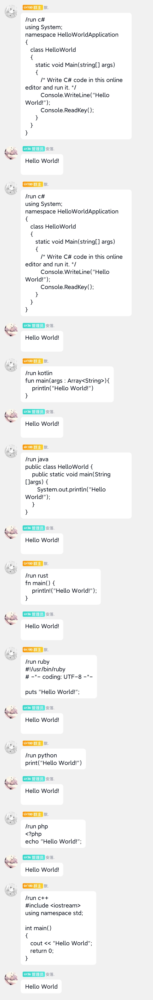

  

# onebot_plugin_coderun
基于runoob.com的在线代码运行插件

## 指令
| 命令 | 权限 |
|:--------:| -------------:|
| /run [目标语言] [具体代码] | 所有人 |

## 支持语言

- kotlin
- java
- lua
- nodejs
- go
- swift
- rust
- ruby
- c#
- c++
- c
- py
- php

## TIPS
暂不支持输入...待更新

## 使用截图

